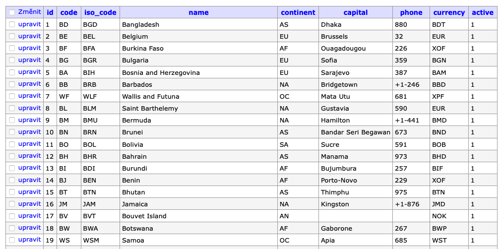
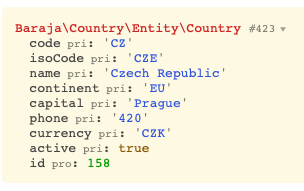

Country
=======

Country management package.

Idea
----

This package provides an interface for working with countries. All countries always return as an entity that meets the Country interface. The specific implementation of the entity is decided by the package itself according to the available environment.

Possible implementations:

- DoctrineCountry
- FileCountry

The default country data is available in the json data file, according to which the data is subsequently updated.

Basic usage
-----------

The main control logic is in the `CountryManager` service, which provides communication and servicing of database entities.

The country information is stored in Doctrine entities, which are automatically generated on the first call based on a data file downloaded via the API.

We use the [country.io](http://country.io/data/) service to retrieve the data.



Použití:

```php
$manager = new \Baraja\Country\CountryManager;
$manager->getByCode('CZ');
```

Returns:


